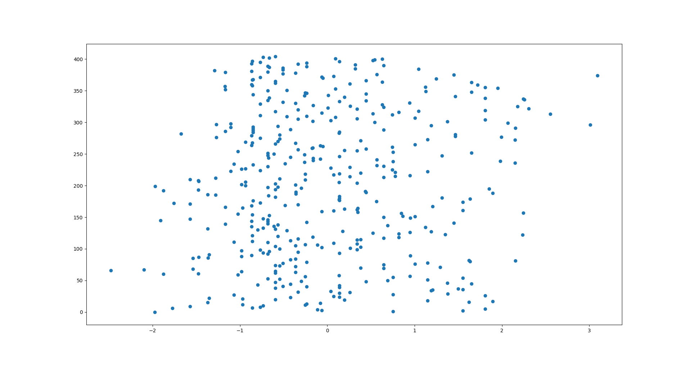
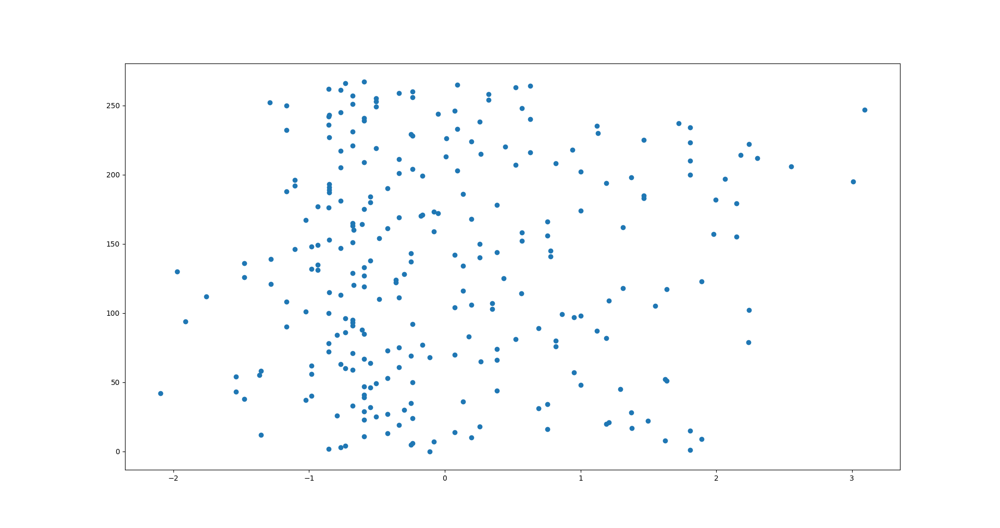

# Sample Reduction for k-Nearest Neighbors

This GitHub repository implements sample reduction, a technique used to reduce the size of the dataset used in a k-nearest neighbors machine learning model, while maintaining accuracy. By selecting a random subset of the data that is representative of the total population, this technique reduces computational time required for classifying new instances. It is important to note that if the selected subset is not representative of the total population, accuracy may be reduced. Therefore, careful consideration is necessary when selecting the subset of data to ensure accuracy is maintained in the k-nearest neighbors model.

## What is Sample Reduction?

Sample reduction is a technique that refers to reducing the size of the data sample used in a machine learning model, while attempting to maintain the model's accuracy. In the context of a k-nearest neighbors program, this refers to reducing the size of the dataset used to search for the k nearest neighbors to a new instance.

Instead of using the entire available dataset, sample reduction can be used to select a random subset of the data that is representative of the total population of data. This smaller subset is then used to calculate the k nearest neighbors, which can significantly reduce the computational time required for classifying new instances.

However, it is important to note that sample reduction can also reduce the accuracy of the model if the selected subset is not representative of the total population of data. Therefore, care must be taken when selecting the subset of data to ensure adequate accuracy is maintained in the k-nearest neighbors model.

## Data Normalide

## Delete Neighbor

## Usage

To use this repository, simply clone the repository and run the provided `sample_reduction.py` script. 

## License

This project is licensed under the GNU License. See the [LICENSE](LICENSE) file for more information.
